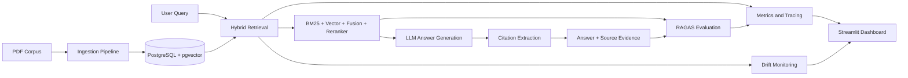

# DocIntel
### Production RAG System for Explainable Regulatory Intelligence


DocIntel is a production-grade retrieval-augmented generation system built around one hard idea:

**an answer from AI is only useful if you can trust where it came from, measure how good it is, and detect when it starts getting worse.**

This project takes a dense regulatory document, the EU AI Act, and turns it into a fully operational intelligence system with:

- hybrid retrieval instead of naive vector search
- citation-grounded answers instead of unsupported text generation
- RAGAS evaluation instead of "it seems to work"
- drift monitoring instead of silent degradation
- an operations dashboard instead of a black box

It is meant to demonstrate end-to-end product thinking, backend engineering, MLOps maturity, and production-minded AI system design in one repo.

---

## Table of Contents

- Short Abstract
- Deep Introduction
- The Entire System Explained
- Why This Is Not a Toy Demo
- Verified Snapshot
- System Architecture
- Product and Recruiter Takeaways
- Deployment and Operations
- Developer Notes
- References

---

## Short Abstract

Imagine a legal team, compliance team, or policy analyst trying to work with a 144-page regulation.

They do not just need "an answer."

They need:

- the right answer
- the part of the document that supports it
- confidence that retrieval quality is not regressing over time
- a way to evaluate changes before they go live
- visibility into cost, latency, and system behavior

That is what DocIntel does.

It ingests the official EU AI Act PDF, breaks it into semantically meaningful chunks, indexes it with both keyword search and vector search, reranks results, generates citation-grounded answers, scores performance with RAGAS, monitors drift with Evidently, traces behavior with LangSmith, and exposes everything through a FastAPI service plus a Streamlit operations dashboard.

So this is not just "RAG over PDFs."

It is a full operating system for reliable document intelligence.

---

## Deep Introduction

### The real problem this project solves

Most RAG projects look impressive in a demo and then fall apart in real use.

A typical flow is:

1. A document is embedded into vectors.
2. A user asks a question.
3. The system retrieves some chunks.
4. A model writes an answer.

That sounds good, but it leaves the most important business questions unanswered:

- Did retrieval actually fetch the right evidence?
- Can the user see exactly where the answer came from?
- How do we know quality did not drop after a code change?
- What happens when user behavior changes over time?
- How would an operator investigate a bad answer?

In other words, most RAG demos optimize for the first answer.
Real products need to optimize for trust, reliability, traceability, and operations.

### Why the EU AI Act is a good test case

The EU AI Act is a strong benchmark because it is exactly the kind of document that breaks simplistic AI systems:

- it is long
- it is legally dense
- it contains structured sections, annexes, and cross-references
- many questions depend on precise wording
- users need cited answers, not vague summaries

If a system can handle this kind of corpus well, it says something real about the engineering quality behind it.

### What this repository demonstrates

This project demonstrates full-stack ownership across:

- document ingestion
- retrieval system design
- answer generation
- citation handling
- evaluation pipelines
- CI quality gates
- observability
- drift monitoring
- dashboard analytics
- Dockerized deployment

That combination is what makes it portfolio-grade rather than tutorial-grade.

---

## The Entire System Explained

### 1. Document ingestion

The system starts by taking the official EU AI Act PDF and converting it into a searchable corpus.

It does not just split on arbitrary character counts.
It performs structure-aware chunking so that sections remain meaningful and citations can later point back to human-readable locations such as article and annex references.

Each chunk is then stored with:

- text
- page range
- section path
- vector embedding
- metadata for traceability

### 2. Hybrid retrieval

Instead of depending on one retrieval method, DocIntel combines several:

- BM25 for lexical matching
- pgvector for semantic similarity
- Reciprocal Rank Fusion to merge rankings
- a cross-encoder reranker to improve final ordering

In plain English, the system tries to get the best of both worlds:

- keyword search is good when exact legal wording matters
- semantic search is good when the wording changes but the meaning is similar
- reranking helps recover the strongest evidence before generation

This is a more credible production setup than basic vector-only retrieval.

### 3. Citation-grounded answer generation

Once retrieval finds the best chunks, the answer pipeline sends them to the language model with citation markers.

The generated answer is then post-processed so the system can return:

- the final answer text
- the cited chunk ids
- page numbers
- document title
- section paths

So the output is not just "here is an answer."
It is "here is an answer, and here is the supporting evidence."

### 4. Evaluation with RAGAS

One of the strongest parts of the system is that it evaluates itself.

It uses RAGAS-based scoring across four core dimensions:

- faithfulness
- context precision
- context recall
- answer relevancy

This means the repo has a real framework for asking:

- are answers grounded in retrieved evidence?
- is retrieval noisy?
- are we missing relevant context?
- does the answer actually address the question?

That evaluation layer is what turns a RAG app into an engineering system.

### 5. Drift monitoring

Even if a system works today, that does not mean it will behave the same way next week.

So DocIntel also includes a drift monitoring layer using Evidently.
It tracks changes in:

- query patterns
- embedding behavior
- retrieval quality signals
- report status over time

This is especially important for systems that will be used repeatedly in live environments rather than only shown once in a demo.

### 6. Operations dashboard

The Streamlit dashboard gives operators a live view of the system.

It includes views for:

- evaluation trends
- drift reports
- cost and latency
- retrieval exploration

That means the system is not only built to answer questions.
It is also built to be observed, debugged, and improved.

---

## Why This Is Not a Toy Demo

Many AI repositories are really just wrappers around an LLM API.
This one goes much further.

### It has a real data model

The system persists documents, chunks, queries, retrieval traces, answers, citations, evaluation runs, evaluation cases, and drift reports in PostgreSQL.

### It has real retrieval engineering

This is not vector search alone.
It combines lexical retrieval, semantic retrieval, fusion, and reranking.

### It has real quality control

Evaluation is built into the project through RAGAS and GitHub Actions.

### It has real monitoring

Metrics, tracing, and drift reporting are first-class parts of the system.

### It has real deployment shape

The repo includes Dockerfiles, Compose-based local deployment, CI workflows, and a read-only operations dashboard.

That is why the right mental model for this project is:

**production-minded AI platform**

not

**chatbot proof of concept**

---

## Verified Snapshot

| Area | Verified Result |
|---|---|
| Corpus | Official EU AI Act PDF ingested: 144 pages, 331 chunks |
| Retrieval quality | `hybrid_reranked` beats `vector_only` on the benchmark |
| Benchmark result | precision@10: `0.150` vs `0.100`; recall@10: `0.750` vs `0.500` |
| API quality | 37 API tests passing |
| Dashboard quality | 3 dashboard tests passing |
| Static checks | Ruff clean, mypy clean |
| Drift monitoring | Evidently report generation verified |
| CI | GitHub Actions run `24476974916` passed |
| Container proof | Ubuntu CI built both API and dashboard images successfully |

### Current live-provider note

The system itself is implemented and verified, but the latest local OpenRouter live verification run is currently blocked by provider budget limits on the local-only key:

- default generation model returned `429`
- backup verification model returned `403 Key limit exceeded`

That is an external provider/account constraint, not a missing implementation gap inside the repo.

---

## System Architecture



### In plain English

The system works like this:

1. ingest a document
2. store chunks and embeddings
3. retrieve evidence using hybrid search
4. generate an answer tied to citations
5. score the answer pipeline with RAGAS
6. monitor system behavior over time
7. expose everything through an operator dashboard

That gives the project both user-facing intelligence and operations-facing visibility.

---

## Product and Recruiter Takeaways

If you are a recruiter, hiring manager, or product leader, this repo is meant to show more than just Python coding ability.

It shows:

- end-to-end ownership of an AI product, not just one script
- strong judgment about reliability, not only model usage
- understanding of production concerns like CI, monitoring, tracing, drift, and deployment
- ability to design systems that are explainable and measurable
- ability to structure work across backend, data, MLOps, and UI layers

In short, this project signals someone who thinks about AI systems the way real products need to be built.

---

## Deployment and Operations

### What ships in this repo

- FastAPI application for ingestion, search, answer generation, eval, drift, health, and metrics
- PostgreSQL + pgvector as the data plane
- Streamlit dashboard for operational visibility
- Dockerized local and production-shaped environments
- GitHub Actions for testing, type checking, linting, and image builds

### What the operator gets

- searchable regulatory corpus
- citation-backed answers
- evaluation history
- drift reports
- cost and latency visibility
- retrieval explorer for debugging relevance

That is the difference between "AI output" and "AI system operations."

---

## Developer Notes

### Stack

- Python 3.12
- FastAPI
- PostgreSQL 16
- pgvector
- SQLAlchemy + Alembic
- sentence-transformers
- RAGAS
- LangSmith
- Evidently
- Streamlit
- Docker
- GitHub Actions

### Repository layout

```text
apps/api        FastAPI service and backend logic
apps/dashboard  Streamlit operations dashboard
fixtures        Evaluation fixtures and schema
ops/docker      Docker and Compose support files
```

### Key APIs

- `POST /api/v1/documents`
- `GET /api/v1/documents`
- `POST /api/v1/search`
- `POST /api/v1/answer`
- `POST /api/v1/eval/runs`
- `GET /api/v1/drift/reports`
- `GET /api/v1/health/liveness`
- `GET /metrics`

### Local quick start

```powershell
docker compose up -d db
uv run --directory apps/api alembic upgrade head
uv run --directory apps/api uvicorn docintel.main:app --reload --app-dir src
uv run --directory apps/dashboard streamlit run app.py
```

### Useful checks

```powershell
uvx --from ruff==0.15.7 ruff check apps/api/src apps/api/tests apps/dashboard
uv run --directory apps/api --with mypy==1.18.2 mypy --config-file ../../mypy.ini src
uv run --directory apps/api pytest tests -v
uv run --directory apps/dashboard pytest tests/test_db_queries.py -v
uv run --directory apps/api python -m docintel.tools.benchmark_retrieval --top-k 10
uv run --directory apps/api python -m docintel.tools.run_drift --window-days 7 --reference-window-days 7
```

### Environment variables

Core runtime values live in `.env.example`.

The most important ones are:

- `DATABASE_URL`
- `API_KEYS`
- `SECRET_KEY`
- `OPENROUTER_API_KEY`
- `DEFAULT_GENERATION_MODEL`
- `DEFAULT_JUDGE_MODEL`
- `LANGSMITH_API_KEY`
- `LANGSMITH_TRACING`

---

## References

- EU AI Act official text
- FastAPI
- PostgreSQL
- pgvector
- RAGAS
- LangSmith
- Evidently
- Streamlit

---

## License

MIT

---

## Author

**Mehul Upase**

- GitHub: [@Mehulupase01](https://github.com/Mehulupase01)
- Email: `siya.mehul@outlook.com`
