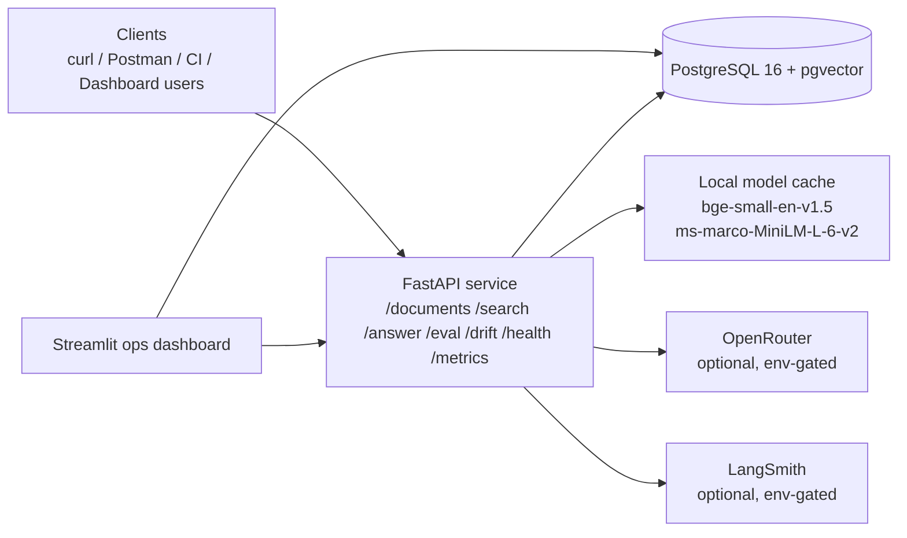

# DocIntel: Production RAG with RAGAS Eval, Hybrid Search, and Drift Monitoring

DocIntel is a production-shaped document intelligence system for answering regulatory questions over the EU AI Act with provenance, evaluation, and operational visibility built in from the start.

Instead of treating retrieval-augmented generation as a demo chatbot, this repo treats it like an engineered service: documents are parsed and chunked into a searchable corpus, retrieval uses BM25 plus pgvector plus reranking, answers are citation-grounded, evaluation is codified through RAGAS, drift is tracked with Evidently, and operators get a read-only Streamlit dashboard over the same data plane.

## Why This Exists

Most RAG examples stop at "the model answered something plausible." That is not enough for a legal or regulatory corpus.

DocIntel is designed to answer a stricter question:

- Can we explain where an answer came from?
- Can we measure whether retrieval quality is improving or regressing?
- Can we detect drift before users notice a failure?
- Can we expose the system to operators without rebuilding business logic in a second app?

This repository answers those questions with one modular monolith:

- FastAPI for ingestion, search, answer generation, evaluation, drift, health, and metrics
- PostgreSQL 16 + pgvector for both lexical and vector retrieval traces
- Streamlit for read-only operations visibility
- GitHub Actions for lint, type-check, tests, and evaluation gating

## Verified Snapshot

| Area | Verified State |
|---|---|
| Corpus | Official English EU AI Act PDF ingested with `144` pages and `331` chunks |
| Retrieval benchmark | `hybrid_reranked` precision@10 `0.150` vs `vector_only` `0.100` on the seeded benchmark fixture |
| API quality gates | Ruff clean, mypy clean, `37` API tests passing locally |
| Dashboard quality gates | mypy clean, `3` dashboard DB-helper tests passing, Streamlit page smoke renders passing |
| Observability | Root `GET /metrics` implemented and verified in-process |
| Drift | Persisted drift report `53df52b6-07e9-49b8-8b6a-a213c35e9a37` with HTML artifact output |
| GitHub Actions | `ci.yml` passed on GitHub run `24394769593` |
| Compose validation | `docker compose -f docker-compose.yml -f docker-compose.prod.yml config` passes |
| Final live blockers | Local OpenRouter verification is currently blocked by provider/account limits: default generation returns `429` and the backup verification lane returns `403 Key limit exceeded` with the current local-only key |

## System Overview



### Request Path

1. A document is ingested into `documents` and `chunks`.
2. A search request fans into BM25 and pgvector retrieval.
3. Results are fused with Reciprocal Rank Fusion and optionally reranked with a cross-encoder.
4. The answer path builds a citation-marked prompt and calls OpenRouter.
5. Citation markers are extracted back into first-class `citations` rows linked to chunk ids.
6. Query, retrieval, answer, eval, and drift artifacts are persisted for later analysis.

## Product Surface

### API endpoints

- `POST /api/v1/documents`
- `GET /api/v1/documents`
- `GET /api/v1/documents/{id}`
- `DELETE /api/v1/documents/{id}`
- `POST /api/v1/documents/{id}/reingest`
- `POST /api/v1/search`
- `POST /api/v1/answer`
- `POST /api/v1/eval/runs`
- `GET /api/v1/eval/runs`
- `GET /api/v1/eval/runs/{id}`
- `GET /api/v1/eval/runs/{id}/cases`
- `GET /api/v1/drift/reports`
- `GET /api/v1/drift/reports/{id}`
- `GET /api/v1/health/liveness`
- `GET /api/v1/health/readiness`
- `GET /metrics`

### Retrieval strategies

- `vector_only`
- `bm25_only`
- `hybrid`
- `hybrid_reranked`

### Dashboard views

- `Home`: latest KPI summary
- `Eval Trends`: metric trend lines for faithfulness, context precision, context recall, and answer relevancy
- `Drift Reports`: persisted drift history plus local HTML artifact viewing
- `Cost and Latency`: recent spend, p50/p95 latency, model-cost mix
- `Retrieval Explorer`: live `/search` comparison across strategies

## Repository Layout

```text
apps/api        FastAPI service, models, routers, services, Alembic, tests
apps/dashboard  Streamlit dashboard, DB helpers, page scripts, tests
fixtures        Golden evaluation fixture and schema
ops/docker      Postgres init and compose overlay assets
docs            API, ingestion, retrieval, evaluation, observability, drift, deployment, verification
```

## Local Development

### 1. Start the base stack

```powershell
docker compose up -d
uv run --directory apps/api alembic upgrade head
```

### 2. Ingest the official EU AI Act PDF

```powershell
uv run --directory apps/api python -m docintel.tools.ingest_eu_ai_act --path "data/source/eu_ai_act_2024_1689_en.pdf" --source-uri "https://op.europa.eu/o/opportal-service/download-handler?format=PDF&identifier=dc8116a1-3fe6-11ef-865a-01aa75ed71a1&language=en&productionSystem=cellar"
```

### 3. Run a search

```powershell
curl -X POST http://localhost:8000/api/v1/search `
  -H "X-API-Key: dev-key-change-me" `
  -H "Content-Type: application/json" `
  -d "{\"query\":\"What is a high-risk AI system?\",\"strategy\":\"hybrid_reranked\",\"top_k\":5}"
```

### 4. Bring up the dashboard overlay

```powershell
docker compose -f docker-compose.yml -f ops/docker/compose.full.yml up -d
```

### 5. Validate the production overlay shape

```powershell
docker compose -f docker-compose.yml -f docker-compose.prod.yml config
```

## Validation and Quality

### Local checks currently passing

```powershell
uvx --from ruff==0.15.7 ruff check apps/api/src apps/api/tests apps/dashboard
uv run --directory apps/api --with mypy==1.18.2 mypy --config-file ../../mypy.ini src
uv run --directory apps/dashboard --with mypy==1.18.2 mypy --config-file ../../mypy.ini app.py lib pages
uv run --directory apps/api pytest tests -v
uv run --directory apps/dashboard pytest tests/test_db_queries.py -v
uv run --directory apps/dashboard python -m compileall app.py lib pages tests
```

### Evaluation posture

- Golden fixture shipped: `fixtures/eu_ai_act_qa_v1.json`
- Current payload version: `v0.1`
- Current fixture size: `25` reviewed seed cases
- Workflow committed: `.github/workflows/ragas-eval.yml`
- GitHub-hosted live execution is now optional and skips cleanly when `OPENROUTER_API_KEY` is not configured in repo secrets
- Local live verification uses the tracked defaults first, then the approved verification-only backup pair:
  - generation: `anthropic/claude-haiku-4.5`
  - judge: `openai/gpt-4o-mini`

### Drift posture

- Weekly APScheduler drift job is registered in the API lifespan
- One-shot CLI exists: `uv run --directory apps/api python -m docintel.tools.run_drift`
- Persisted HTML drift artifacts are stored under `apps/api/artifacts/drift/`

## Deployment

Deployment instructions live in [docs/deployment.md](docs/deployment.md).

In short:

- `docker-compose.yml` is the local base stack
- `ops/docker/compose.full.yml` adds the dashboard
- `docker-compose.prod.yml` adds tagged images, restart policies, resource limits, and named artifact storage

## Known Release Gates

These are the remaining release blockers as of 2026-04-15:

- The local OpenRouter key is currently over its daily budget for the verification lanes:
  - local live `/api/v1/answer` with the tracked default `minimax/minimax-m2.5:free` returns upstream `429`
  - local live `/api/v1/answer` with the approved verification model `anthropic/claude-haiku-4.5` returns upstream `403 Key limit exceeded`
  - local live eval with the tracked default pair errors immediately on generation with upstream `429`
  - local live eval with the verification pair `anthropic/claude-haiku-4.5` + `openai/gpt-4o-mini` errors immediately with upstream `403 Key limit exceeded`
- `ragas-eval.yml` is now intentionally optional under the local-only secret policy; repo-secret absence is no longer a release blocker by itself
- `docker build -t docintel-dashboard:test apps/dashboard` succeeds locally, but a fresh API image rebuild on this Windows Docker Desktop host still times out after 60 minutes, so Linux CI image builds are the authoritative container proof

## Docs

- [API](docs/api.md)
- [Ingestion](docs/ingestion.md)
- [Retrieval](docs/retrieval.md)
- [Evaluation](docs/evaluation.md)
- [Observability](docs/observability.md)
- [Drift](docs/drift.md)
- [Deployment](docs/deployment.md)
- [Verification](docs/verification.md)
- [Release Checklist](docs/release_checklist.md)

## References

- EU AI Act official English PDF via Publications Office download handler
- FastAPI
- PostgreSQL 16 + pgvector
- sentence-transformers
- RAGAS
- Evidently
- Streamlit
