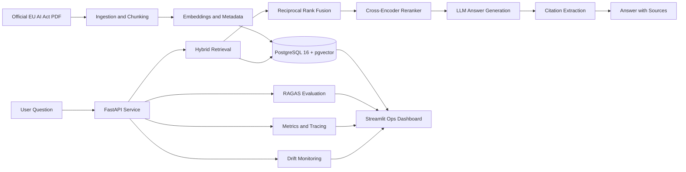
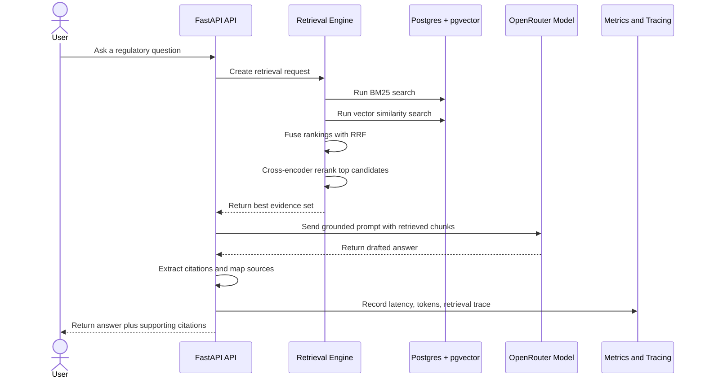
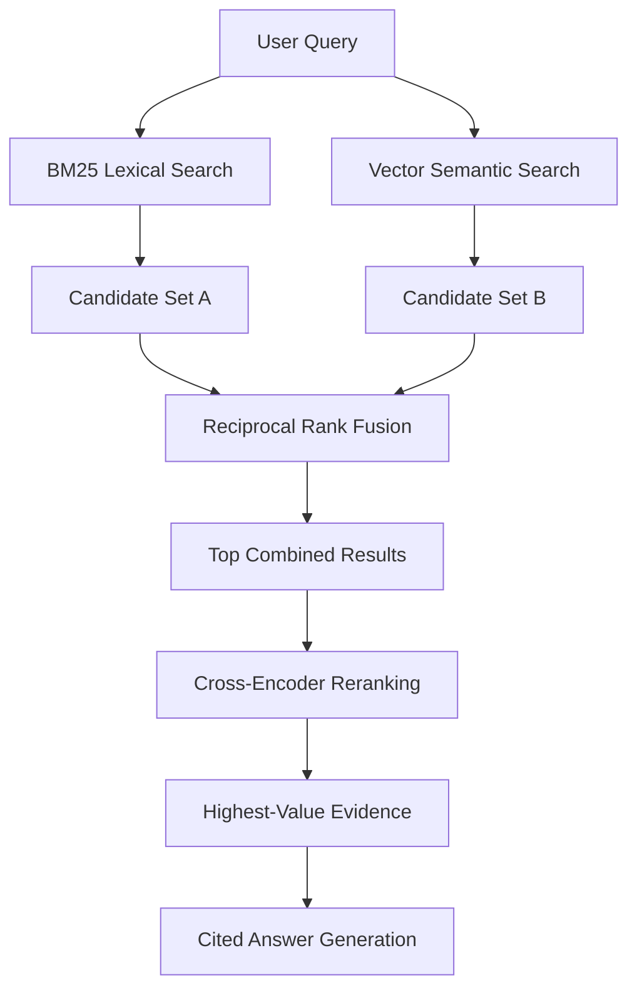
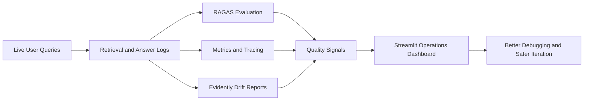

# DocIntel
### Production RAG with Hybrid Retrieval, Citation-Grounded Answers, RAGAS Evaluation, and Drift Monitoring


DocIntel is a production-grade document intelligence system built over the official EU AI Act.

At a high level, it answers difficult regulatory questions using a retrieval-augmented generation pipeline that is designed to be explainable, measurable, and operationally trustworthy. Instead of behaving like a generic PDF chatbot, it ingests the full legal document, indexes it intelligently, retrieves evidence with both keyword and semantic search, generates citation-grounded answers, evaluates answer quality with RAGAS, monitors behavior drift over time, and exposes everything through a backend API plus an operations dashboard.

This is the difference between a model demo and an AI system that could actually be taken seriously in a production environment.

* * *

## Table of Contents

- Executive Summary
- Why This Project Matters
- System Overview
- How a Question Turns Into an Answer
- Why the Retrieval Stack Is Stronger Than Typical RAG
- How the Platform Proves Quality
- What This Project Demonstrates
- Running the Project
- Technical Appendix
- References

* * *

## Executive Summary

Most document AI projects stop at a very simple promise:

1. upload a PDF
2. ask a question
3. get an answer

That may be enough for a short demo, but it breaks down quickly when the document is legally dense, operationally important, or high-stakes.

The EU AI Act is exactly that kind of document. It is long, structured, cross-referenced, terminology-heavy, and easy to misinterpret if retrieval is weak or the language model is left to improvise. In a setting like that, a fluent answer is not enough. The user also needs confidence that:

- the right evidence was retrieved
- the answer is grounded in that evidence
- the system can be evaluated systematically
- quality regressions will be visible over time

DocIntel was built around those requirements.

It combines hybrid retrieval, citation-grounded answering, automated evaluation, request tracing, drift monitoring, and a dashboard into one coherent platform. The result is a project that shows not only how to generate answers from documents, but how to build a complete AI product around correctness, visibility, and operational discipline.

* * *

## Why This Project Matters

There is a big gap between "an AI feature" and "an AI system someone could trust."

If a recruiter, engineering manager, or product leader looks at a typical RAG repository, they usually see one narrow capability: a single endpoint that talks to a model and returns text. That might prove familiarity with tools, but it does not prove the ability to engineer a full end-to-end system.

This project is deliberately broader.

DocIntel is designed to show what happens when AI is treated like a real product surface:

- ingestion is structured, not naive
- retrieval is hybrid, not one-dimensional
- answers are cited, not free-floating
- quality is measured, not guessed
- drift is monitored, not ignored
- operators have a dashboard, not just raw logs

That makes the project relevant not only as a machine learning demo, but also as a backend engineering, applied AI, and production-systems portfolio piece.

* * *

## System Overview

The best way to understand DocIntel is to see it as a pipeline with memory, visibility, and feedback loops.



In plain English, the system works like this:

- the official EU AI Act is ingested and broken into structured chunks
- those chunks are stored with both vector representations and searchable metadata
- every user question goes through a hybrid retrieval process
- the best evidence is reranked before generation
- the model answers using retrieved context rather than raw memory
- citations are extracted so the answer can be traced back to source material
- evaluation, traces, drift reports, and analytics are all persisted for inspection

The key idea is that answering a question is only one part of the system. The rest of the platform exists to make that answer explainable, testable, and operationally visible.

* * *

## How a Question Turns Into an Answer

This is the end-to-end lifecycle of a single question moving through the platform.



That flow is important because it shows that the language model is not acting alone. It is the final step in a larger evidence pipeline.

In weaker systems, the model is often asked to bridge too much uncertainty by itself. In DocIntel, retrieval, reranking, and source mapping do most of the heavy lifting before generation even begins.

* * *

## Why the Retrieval Stack Is Stronger Than Typical RAG

Many RAG systems use one retrieval strategy and hope it is enough. In practice, that is usually where quality starts to fail.

DocIntel combines four retrieval layers because each one solves a different problem:

- BM25 helps capture exact legal or regulatory phrasing
- vector search helps recover semantically related passages
- Reciprocal Rank Fusion combines both views into one stronger candidate set
- cross-encoder reranking improves final precision before generation



This is one of the most important design choices in the repository.

If the system only used vector search, it could miss exact regulatory wording.
If it only used keyword search, it could miss relevant passages expressed in different language.
By combining both and then reranking, DocIntel behaves more like a disciplined information system and less like a best-effort chatbot.

* * *

## How the Platform Proves Quality

A production-grade AI system should not just produce answers. It should also create evidence that those answers are worth trusting.

DocIntel does that through evaluation, observability, and drift monitoring.



That feedback loop matters for a simple reason:

AI systems often fail gradually.

A retrieval change can reduce context quality.
A prompt change can reduce faithfulness.
A model switch can affect consistency.
Query patterns can shift over time.

Without evaluation and monitoring, none of that becomes visible until user trust is already damaged.

With DocIntel, the platform is built to surface those signals early.

### Verified corpus snapshot

- official EU AI Act PDF
- 144 pages
- 331 indexed chunks
- structure-aware chunking with page and section metadata

### Retrieval benchmark snapshot

| Strategy | Precision@10 | Recall@10 |
|---|---:|---:|
| `vector_only` | 0.100 | 0.500 |
| `bm25_only` | 0.150 | 0.750 |
| `hybrid` | 0.150 | 0.750 |
| `hybrid_reranked` | 0.150 | 0.750 |

The point of this table is not to claim perfection. The point is to show that the architecture produces stronger retrieval behavior than a weaker baseline, which is exactly what a serious RAG system should demonstrate.

### Validation surface

The repository includes:

- backend tests
- dashboard tests
- type checking
- linting
- container build checks in CI
- evaluation workflows
- drift reporting

So quality here is not just "the model gave an answer." It is "the surrounding system can be measured and inspected."

* * *

## What This Project Demonstrates

From a portfolio perspective, this repository shows several capabilities at once.

### 1. Applied AI engineering

The project goes beyond model calls and shows how to build a real retrieval-augmented system around evidence, grounding, and measurement.

### 2. Backend and systems design

The FastAPI service, Postgres schema, async persistence layer, migrations, and API contracts are all part of a coherent data-backed platform rather than isolated scripts.

### 3. Search and retrieval engineering

The hybrid retrieval stack demonstrates an understanding that document intelligence quality depends heavily on search architecture, not only on model choice.

### 4. Evaluation discipline

RAGAS-based evaluation turns answer quality into something testable and reviewable, which is a critical production skill in modern AI systems.

### 5. Observability and operations thinking

Metrics, traces, drift reports, and an ops dashboard show that the system was designed to be operated, not merely demonstrated.

### 6. Product-oriented AI implementation

The dashboard and source-grounded answers make the project easier to reason about for non-technical stakeholders, which is often the difference between an interesting prototype and a usable product.

* * *

## Running the Project

The repository can be run as a local development stack or as a production-shaped containerized setup.

### Prerequisites

| Requirement | Version | Purpose |
|---|---|---|
| Python | 3.12+ | API and data pipeline runtime |
| Docker Desktop | Current | Local orchestration and database runtime |
| PostgreSQL | 16 | Primary database |
| uv | Current | Dependency management |

### Environment setup

```powershell
Copy-Item .env.example .env
```

Important environment values include:

- `DATABASE_URL`
- `API_KEYS`
- `SECRET_KEY`
- `OPENROUTER_API_KEY`
- `DEFAULT_GENERATION_MODEL`
- `DEFAULT_JUDGE_MODEL`
- `LANGSMITH_API_KEY`
- `LANGSMITH_TRACING`

### Local development

```powershell
docker compose up -d db
uv run --directory apps/api alembic upgrade head
uv run --directory apps/api uvicorn docintel.main:app --reload --app-dir src
uv run --directory apps/dashboard streamlit run app.py
```

This gives you:

- FastAPI backend
- PostgreSQL with pgvector
- Streamlit operations dashboard

### Production-shaped deployment

```powershell
docker compose -f docker-compose.yml -f docker-compose.prod.yml config
docker compose -f docker-compose.yml -f ops/docker/compose.full.yml up -d
```

### Core runtime URLs

- API: `http://localhost:8000`
- API docs: `http://localhost:8000/docs`
- Dashboard: `http://localhost:8501`
- Metrics: `http://localhost:8000/metrics`

* * *

## Technical Appendix

This section is intentionally pushed toward the end so the README stays understandable to non-developer readers first.

### Repository structure

```text
apps/
  api/                         FastAPI control plane
    src/docintel/
      models/                  SQLAlchemy models
      routers/                 API endpoints
      services/
        ingestion/             PDF parsing, chunking, embeddings
        retrieval/             BM25, vector, fusion, reranking
        generation/            prompts, citations, LLM client
        evaluation/            RAGAS harness and CI gate
        monitoring/            tracing and metrics
        drift/                 Evidently reports and scheduler
      tools/                   benchmark, eval, ingest, drift runners
  dashboard/                   Streamlit operations dashboard
fixtures/                      evaluation fixture and schema
ops/docker/                    Compose overlays and pgvector setup
```

### Public API surface

- `POST /api/v1/documents`
- `GET /api/v1/documents`
- `GET /api/v1/documents/{id}`
- `POST /api/v1/search`
- `POST /api/v1/answer`
- `POST /api/v1/eval/runs`
- `GET /api/v1/eval/runs`
- `GET /api/v1/drift/reports`
- `GET /api/v1/health/liveness`
- `GET /api/v1/health/readiness`
- `GET /metrics`

### Technical stack

- FastAPI
- PostgreSQL 16
- pgvector
- SQLAlchemy
- Alembic
- sentence-transformers
- RAGAS
- LangSmith
- Evidently
- Streamlit
- Docker
- GitHub Actions

### What the project is designed to show technically

- backend API design
- retrieval system engineering
- production-minded LLM integration
- evaluation-driven AI workflows
- observability and monitoring
- dashboard-driven AI operations
- containerized deployment

* * *

## References

- EU AI Act official text
- FastAPI
- PostgreSQL
- pgvector
- sentence-transformers
- RAGAS
- LangSmith
- Evidently
- Streamlit

* * *

## License

MIT

* * *

## Author

**Mehul Upase**

- GitHub: [@Mehulupase01](https://github.com/Mehulupase01)
